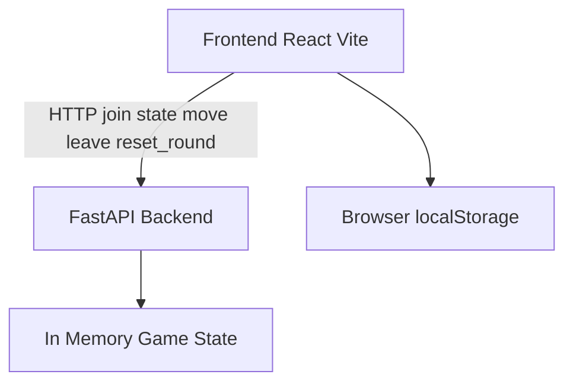

# Spielstatus-Dokumentation für Coding-Agent

Stand: abgeleitet aus [`backend/app.py`](backend/app.py:1), [`frontend/src/main.jsx`](frontend/src/main.jsx:1), [`frontend/package.json`](frontend/package.json:1), [`backend/requirements.txt`](backend/requirements.txt:1), [`start-backend.bat`](start-backend.bat:1), [`start-frontend.bat`](start-frontend.bat:1), [`frontend/index.html`](frontend/index.html:1).

## 1. Projektüberblick

Das Projekt ist ein webbasiertes 2-Spieler-Brettspiel mit Zuschauerrolle.

- Backend: FastAPI-Server mit In-Memory-Spielzustand in [`backend/app.py`](backend/app.py:1)
- Frontend: React-App mit Vite in [`frontend/src/main.jsx`](frontend/src/main.jsx:1)
- Kommunikation: HTTP-API zwischen Browser und Backend auf Port 8000

Es gibt **keine Datenbank** und **keine Persistenz**. Jeder Server-Neustart setzt den Zustand zurück.

## 2. Architektur und Laufzeitmodell



### 2.1 Frontend-Verbindungslogik

- API-Basis wird zur Laufzeit gebildet über [`API_BASE`](frontend/src/main.jsx:4) mit aktuellem Host und Port 8000.
- Ein stabiler Client-Identifier wird über [`createOrGetClientId()`](frontend/src/main.jsx:6) erzeugt und in `localStorage` unter `schach_client_id` gespeichert.
- Das Frontend pollt den Zustand über [`pollState`](frontend/src/main.jsx:81) alle 80 ms per `/state`.

### 2.2 Backend-Zustandsmodell

Zentraler Zustand in globalen Variablen in [`backend/app.py`](backend/app.py:20):

- Figuren:
  - `black_triangles`, `white_triangles`
  - `black_rooks`, `white_rooks`
- Score:
  - `white_score`, `black_score`
- Turn:
  - `current_turn` mit Initialwert `white`
- Rollen:
  - `white_player`, `black_player`
- Heartbeat/Timeout:
  - `white_last_seen`, `black_last_seen`
  - `PLAYER_TIMEOUT_SECONDS = 2.5`

## 3. Spielregeln im aktuellen Stand

## 3.1 Brett und Startaufstellung

- Brett: 8x8 mit Koordinaten `x=0..7`, `y=0..7`
- Schwarze Dreiecke starten auf `y=1`
- Weiße Dreiecke starten auf `y=6`
- Schwarze Türme starten auf `0,0` und `7,0`
- Weiße Türme starten auf `0,7` und `7,7`

Quelle: [`reset_positions()`](backend/app.py:112).

## 3.2 Zugreihenfolge

- Initial ist Weiß am Zug.
- Nach jedem akzeptierten Zug toggelt der Turn zwischen Weiß und Schwarz.
- Falsche Farbe am Zug wird abgewiesen.

Quelle: Turn-Checks in [`move()`](backend/app.py:328) und Toggle in [`move()`](backend/app.py:557).

## 3.3 Zugregeln Dreiecke

Schwarzes Dreieck in [`triangle_black`-Zweig](backend/app.py:369):
- Vorwärts 1 Feld (`y+1`) wenn frei
- Initial optional 2 Felder von Startreihe `y=1`, wenn Zwischenfeld und Ziel frei
- Diagonal schlagen nur auf weiße **Dreiecke**

Weißes Dreieck in [`triangle_white`-Zweig](backend/app.py:417):
- Vorwärts 1 Feld (`y-1`) wenn frei
- Initial optional 2 Felder von Startreihe `y=6`, wenn Zwischenfeld und Ziel frei
- Diagonal schlagen nur auf schwarze **Dreiecke**

Wichtig: Dreiecke können im aktuellen Stand **keine Türme schlagen**, da Capture-Prüfung auf gegnerische Dreieckslisten begrenzt ist.

## 3.4 Zugregeln Türme

Turmregeln werden für Schwarz und Weiß separat verarbeitet in [`move()`](backend/app.py:465) und [`move()`](backend/app.py:510):

- Nur horizontal oder vertikal
- Keine Bewegung durch Figuren hindurch
- Eigene Figur auf Zielfeld blockiert
- Gegnerische Figur auf Zielfeld wird geschlagen

Pfadprüfung erfolgt in [`path_clear_straight()`](backend/app.py:212).

## 3.5 Rundensystem und Score

- Es gibt keinen automatischen Siegzustand.
- Spieler können Runde aktiv aufgeben über `/reset_round`.
- Aufgeber gibt dem Gegner 1 Punkt.
- Danach werden Figurenpositionen zurückgesetzt, Score bleibt erhalten.

Quelle: [`reset_round()`](backend/app.py:567).

## 4. Rollen- und Sessionlogik

## 4.1 Rollen

Rollen:
- `white`
- `black`
- `spectator`

Rollenvergabe erfolgt über `/join` mit gewünschter Rolle.

Quelle: [`join()`](backend/app.py:246).

## 4.2 Spielstartbedingung

Züge sind erst erlaubt, wenn **beide** Rollen Weiß und Schwarz besetzt sind.

Quelle: Guard in [`move()`](backend/app.py:347).

## 4.3 Disconnect-Handling

- Heartbeat wird über `/state` und aktive API-Nutzung aktualisiert.
- Timeout nach 2.5 s ohne Aktivität.
- Wenn laufendes 2-Spieler-Spiel auseinanderfällt, werden beide Spieler entfernt und Positionen zurückgesetzt.

Quelle: [`cleanup_disconnected_players()`](backend/app.py:60), [`touch_player()`](backend/app.py:83), [`clear_all_players_and_reset()`](backend/app.py:47).

## 5. Frontend-Verhalten im aktuellen Stand

## 5.1 UI-Phasen

1. Rollenwahl-Ansicht in [`if (!hasJoined)`](frontend/src/main.jsx:434)
2. Warten auf Gegenspieler in [`if ((rolle === 'white' || rolle === 'black') && !gameReady)`](frontend/src/main.jsx:501)
3. Spielbrett inkl. Score, Turn, Meldung in [`return (...)`](frontend/src/main.jsx:533)

## 5.2 Auswahl- und Klicklogik

- Klick auf eigene Figur selektiert Figurtyp und Quellfeld.
- Zweiter Klick sendet Zielzug an `/move`.
- Zuschauer dürfen keine Züge ausführen.
- Mehrere Debug-Logs zu Capture-Fällen sind enthalten.

Zentral in Cell-`onClick` in [`onClick={async () => { ... }}`](frontend/src/main.jsx:263).

## 5.3 Leave-Mechanik im Browser

Beim Verlassen der Seite werden mehrere Fallbacks genutzt:

- GET `/leave` per `Image`
- `sendBeacon` auf `/leave`
- Fallback-POST mit `keepalive`

Quelle: [`leaveGame`](frontend/src/main.jsx:111).

## 6. Vollständige API-Referenz

Basis-URL aus Frontend-Sicht: `http://<hostname>:8000` siehe [`API_BASE`](frontend/src/main.jsx:4).

Gemeinsame Antwortstruktur bei vielen Endpunkten:
- Figurenlisten
- `score`
- `turn`
- `players`

Quelle: [`current_state()`](backend/app.py:94).

## 6.1 GET `/join`

Zweck: Rolle zuweisen oder Zuschauerstatus liefern.

Parameter:
- `client_id` string, erforderlich
- `desired_role` string, optional, `white|black|spectator`, default `spectator`

Implementierung: [`join()`](backend/app.py:246).

### Request-Beispiel

```http
GET /join?client_id=abc-123&desired_role=white
```

### Response-Beispiel

```json
{
  "role": "white",
  "desired_role": "white",
  "assignment": "assigned",
  "triangles_black": [{ "x": 0, "y": 1 }],
  "triangles_white": [{ "x": 0, "y": 6 }],
  "rooks_black": [{ "x": 0, "y": 0 }, { "x": 7, "y": 0 }],
  "rooks_white": [{ "x": 0, "y": 7 }, { "x": 7, "y": 7 }],
  "score": { "white": 0, "black": 0 },
  "turn": "white",
  "players": {
    "white_taken": true,
    "black_taken": false,
    "white_player": "abc-123",
    "black_player": ""
  }
}
```

## 6.2 POST `/leave`

Zweck: Spieler abmelden.

Body:
- `client_id` string

Implementierung: [`leave()`](backend/app.py:298).

### Request-Beispiel

```http
POST /leave
Content-Type: application/json

{
  "client_id": "abc-123"
}
```

### Response-Beispiel

```json
{
  "accepted": true,
  "message": "Spieler ausgeloggt.",
  "triangles_black": [{ "x": 0, "y": 1 }],
  "triangles_white": [{ "x": 0, "y": 6 }],
  "rooks_black": [{ "x": 0, "y": 0 }, { "x": 7, "y": 0 }],
  "rooks_white": [{ "x": 0, "y": 7 }, { "x": 7, "y": 7 }],
  "score": { "white": 0, "black": 0 },
  "turn": "white",
  "players": {
    "white_taken": false,
    "black_taken": false,
    "white_player": "",
    "black_player": ""
  }
}
```

## 6.3 GET `/leave`

Zweck: GET-Variante für Leave, nutzt intern dieselbe Logik.

Parameter:
- `client_id` string

Implementierung: [`leave_get()`](backend/app.py:316).

### Request-Beispiel

```http
GET /leave?client_id=abc-123
```

### Response-Beispiel

Antwortstruktur identisch zu POST `/leave`.

## 6.4 GET `/state`

Zweck: Spielzustand abfragen, optional Heartbeat aktualisieren.

Parameter:
- `client_id` string, optional

Implementierung: [`get_state()`](backend/app.py:321).

### Request-Beispiel

```http
GET /state?client_id=abc-123&t=1712345678901
```

### Response-Beispiel

```json
{
  "triangles_black": [{ "x": 0, "y": 1 }],
  "triangles_white": [{ "x": 0, "y": 6 }],
  "rooks_black": [{ "x": 0, "y": 0 }, { "x": 7, "y": 0 }],
  "rooks_white": [{ "x": 0, "y": 7 }, { "x": 7, "y": 7 }],
  "score": { "white": 0, "black": 0 },
  "turn": "white",
  "players": {
    "white_taken": true,
    "black_taken": true,
    "white_player": "abc-123",
    "black_player": "def-456"
  }
}
```

## 6.5 POST `/move`

Zweck: Spielfigur bewegen.

Body-Felder:
- `client_id` string, erforderlich
- `color` string, erforderlich
- `x` int, Ziel x
- `y` int, Ziel y
- `from_x` int, für Dreiecke und Türme effektiv erforderlich
- `from_y` int, für Dreiecke und Türme effektiv erforderlich

Implementierung: [`move()`](backend/app.py:328).

### Request-Beispiel

```http
POST /move
Content-Type: application/json

{
  "client_id": "abc-123",
  "color": "triangle_white",
  "from_x": 4,
  "from_y": 6,
  "x": 4,
  "y": 4
}
```

### Response-Beispiel akzeptiert

```json
{
  "accepted": true,
  "message": "Weißer Bauer wurde 2 Felder bewegt.",
  "triangles_black": [{ "x": 0, "y": 1 }],
  "triangles_white": [{ "x": 4, "y": 4 }],
  "rooks_black": [{ "x": 0, "y": 0 }, { "x": 7, "y": 0 }],
  "rooks_white": [{ "x": 0, "y": 7 }, { "x": 7, "y": 7 }],
  "score": { "white": 0, "black": 0 },
  "turn": "black",
  "players": {
    "white_taken": true,
    "black_taken": true,
    "white_player": "abc-123",
    "black_player": "def-456"
  }
}
```

### Response-Beispiel abgelehnt

```json
{
  "accepted": false,
  "message": "Spiel startet erst, wenn Weiß und Schwarz besetzt sind.",
  "triangles_black": [{ "x": 0, "y": 1 }],
  "triangles_white": [{ "x": 0, "y": 6 }],
  "rooks_black": [{ "x": 0, "y": 0 }, { "x": 7, "y": 0 }],
  "rooks_white": [{ "x": 0, "y": 7 }, { "x": 7, "y": 7 }],
  "score": { "white": 0, "black": 0 },
  "turn": "white",
  "players": {
    "white_taken": true,
    "black_taken": false,
    "white_player": "abc-123",
    "black_player": ""
  }
}
```

## 6.6 POST `/reset_round`

Zweck: Runde aufgeben, Gegnerpunkt vergeben, Figuren zurücksetzen.

Body:
- `client_id` string

Implementierung: [`reset_round()`](backend/app.py:567).

### Request-Beispiel

```http
POST /reset_round
Content-Type: application/json

{
  "client_id": "abc-123"
}
```

### Response-Beispiel

```json
{
  "accepted": true,
  "message": "Runde zurückgesetzt. Punkt für Schwarz.",
  "triangles_black": [{ "x": 0, "y": 1 }],
  "triangles_white": [{ "x": 0, "y": 6 }],
  "rooks_black": [{ "x": 0, "y": 0 }, { "x": 7, "y": 0 }],
  "rooks_white": [{ "x": 0, "y": 7 }, { "x": 7, "y": 7 }],
  "score": { "white": 0, "black": 1 },
  "turn": "white",
  "players": {
    "white_taken": true,
    "black_taken": true,
    "white_player": "abc-123",
    "black_player": "def-456"
  }
}
```

## 7. Bekannte technische Eigenschaften des aktuellen Stands

- Zustandsverwaltung ist vollständig In-Memory und pro Prozess.
- Kein Auth-System, Identität basiert auf `client_id`.
- CORS ist vollständig offen `allow_origins=*`.
- Polling-Frequenz ist sehr hoch mit 80 ms.
- Es gibt Debug-Prints im Backend und `console.info` im Frontend.

Referenzen:
- CORS in [`app.add_middleware(...)`](backend/app.py:13)
- Polling in [`setInterval(pollState, 80)`](frontend/src/main.jsx:93)

## 8. Lokaler Start

Backend:
- Script [`start-backend.bat`](start-backend.bat:1)
- Erstellt venv, installiert Dependencies, startet Uvicorn auf Port 8000

Frontend:
- Script [`start-frontend.bat`](start-frontend.bat:1)
- Installiert Pakete und startet Vite auf Port 5173

## 9. Relevante Dateien für Agentenarbeit

- Kernbackend: [`backend/app.py`](backend/app.py:1)
- Frontend-App: [`frontend/src/main.jsx`](frontend/src/main.jsx:1)
- Frontend-Konfiguration: [`frontend/package.json`](frontend/package.json:1), [`frontend/vite.config.js`](frontend/vite.config.js)
- Startskripte: [`start-backend.bat`](start-backend.bat:1), [`start-frontend.bat`](start-frontend.bat:1)
- Einstieg HTML: [`frontend/index.html`](frontend/index.html:1)

Diese Datei dient als verlässliche Ist-Stand-Basis für einen Coding-Agent, um gezielte Änderungen auf dem aktuellen Verhalten aufzubauen.
